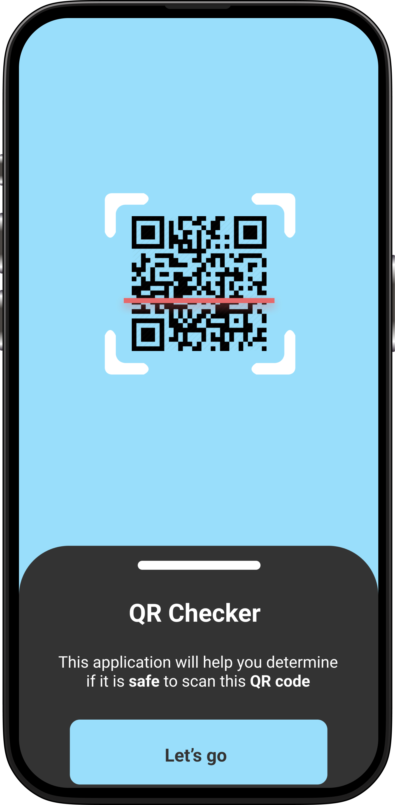
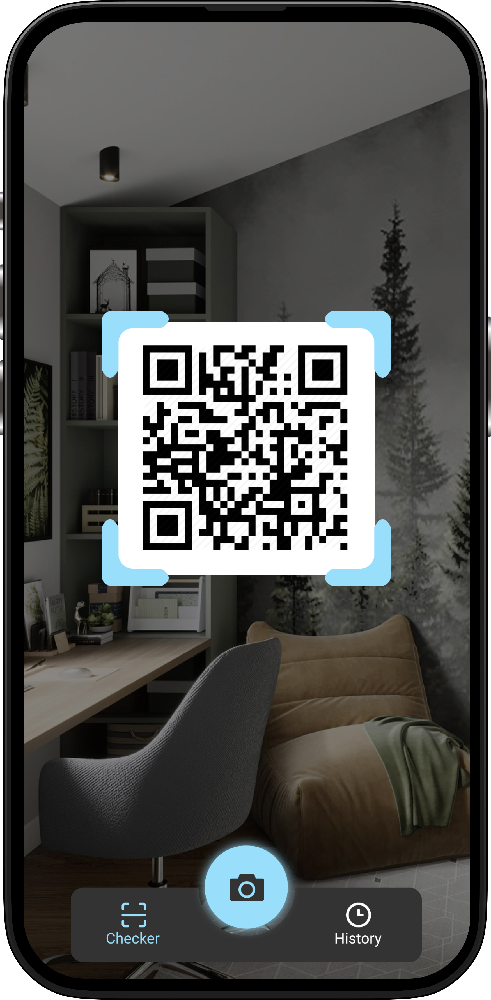
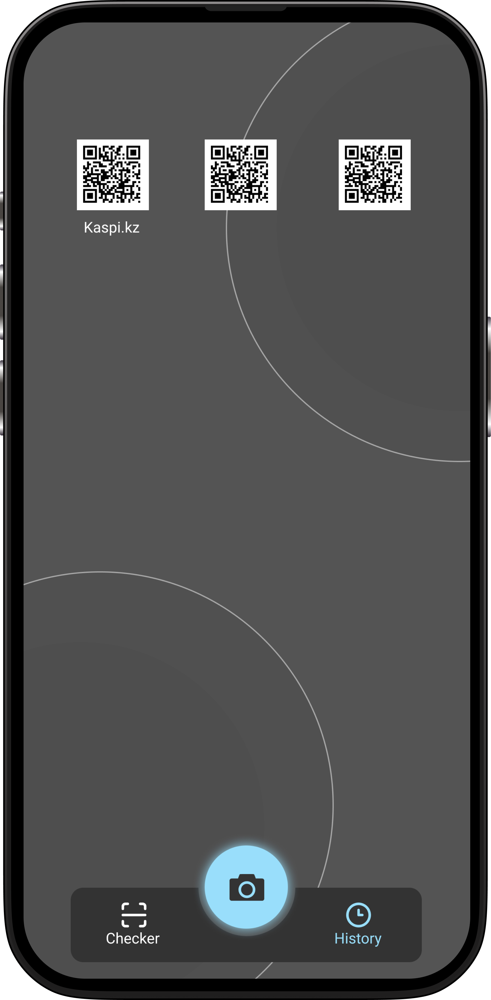

# SafeQR 

SafeQR — это мобильное приложение, использующее машинное обучение для проверки безопасности QR-кодов. Оно создано для защиты пользователей от мошенничества и опасных ссылок, которые могут скрываться за QR-кодами.

